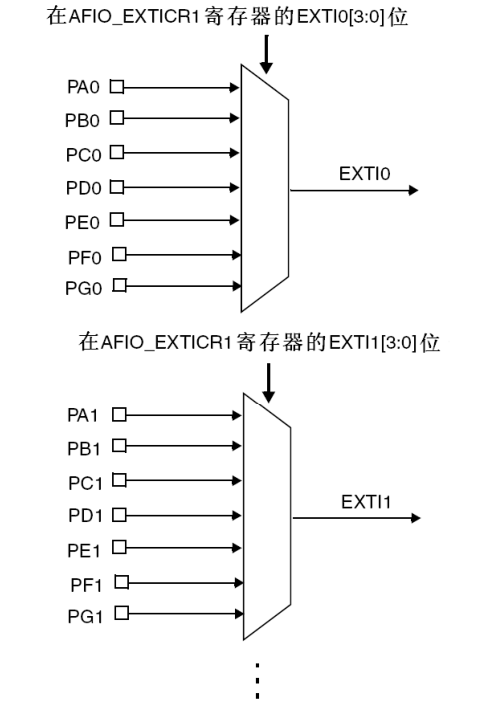

# 裸奔STM32 - 外部中断EXTI
* [首页](.../README.md)    
* [Back](../README.md)

## 认识中断线：

中断线用来连接外部中断或事件。外部中断与中断线连接方式如下图：   

非互联型产品有19个能产生事件/中断清流的边沿检测器。  
其中0-15中断线针对外部中断时，每个中断线n可以连接到对应GPIOx的n引脚。
因此每个中断线使用前应当配置连接到哪个GPIO.

## 认识外部中断：
外部中断是由外部信号变化引起的。因此，要产生外部中断，要知道是什么方式引起的中断，STM32外部中断
可以选择是上升/下降引起中断，两者可以同时选择即上下边沿都产生中断。STM32所有IO都可以用作外部中断，
但实际上不是所有都是使用上，因此可以通过屏蔽寄存器选择需要的中断。

# 认识中断：
中断是指有外部中断/事件产生，提醒MCU马上处理的一种机制。但MCU是只有一双手，同时只能干一件事，
因此中断产生时，先会设置中断挂起位，通知MCU这里有个中断，请快速处理。MCU处理完中断后，请确认此中断已经处理（清除中断标志）。
中断处理是在中断函数中实现，只要MCU有空并轮到次中断处理，MCU会进入该中断指定的处理函数中处理。

# 特性：
* 每个输入线可配置独立的输入类型(脉冲/挂起)和对应触发事件(上下双边触发);
* 每个输入线可独立被屏蔽。
* 挂起寄存器保存着状态线的中断请求。    
   

## 设置中断：
1.配置并使能中断线
2.设置触发方式
3.中断屏蔽寄存器中写1允许中断

## 中断响应：
1.外部输入产生中断请求，挂起位置1
2.挂起寄存器中相应位写1清除请求

## 外部中断使用总结：
1.配置需要设置为外部中断的引脚。
2.选择触发类型
3.开启中断

## 涉及到寄存器：  
**EXTI->IMR**  中断屏蔽寄存器
说明：屏蔽寄存器用来开放中断请求，使能中断

**EXTI->RTSR**   
说明：上升触发事件选择寄存器

**EXTI->FTSR**  
说明：下降触发事件选择寄存器

**EXTI->PR** 挂起寄存器   
说明：标识中断产生。

**AFIO_EXTICR1-4** 外部中断寄存器
总共4个32位寄存器。每个寄存器只使用低16位，每4位控制一个EXTIx外部中断输入源。   

**例如：**
AFIO->EXTICR1 = 0 |(1<<4)|(2<<8)|(6 <<12);//表示 PA0作为EXTI0外部中断输入，PB1作为EXTI1外部中断输入，PG3作为EXTI3外部中断输入。

外设端口配置请看技术手册8.1.11外设的GPIO配置。外部中断可配置为浮空/上拉/下拉输入。
每个中断都需要通过NVIC来配置中断优先级，这里为了便于理解就使用默认优先级，不配置了。

## MDK编程：

	EXTI_Init(void)
	{
		//设置PB0上下边沿触发中断
		RCC->APB2ENR |= 1<<0;	//使能AFIO时钟
		RCC->APB2ENR |= 1<<3;	//使能PB时钟
		GPIOB->CRL |= 4 << 4;	//PB1作为浮空输入
		AFIO->EXTICR[0] |= 1 << 4;//选择PB与EXTIO1连接，即PB1作为外部中断源
		EXTI->RTSR |= 1<< 1;	//上升沿触发
		EXTI->FTSR |= 1<< 1;	//下降沿触发
		
		NVIC_Set();//设置中断优先级等
		EXTI->IMR |= 1 << 1;	//开发中断线1中断请求
	}   
	
STM32外部中断线0-4使用独立的中断函数处理，其他中断线共用中断函数。
5-9使用EXTI9_5_IRQHandler，10-15使用EXTI15_10_IRQHandler。  

	void EXTI1_IRQHandler(void)
	{
		//外部中断线0中断处理函数
		EXTI->PR |= 1<< 1;//清除中断标志位
	}

